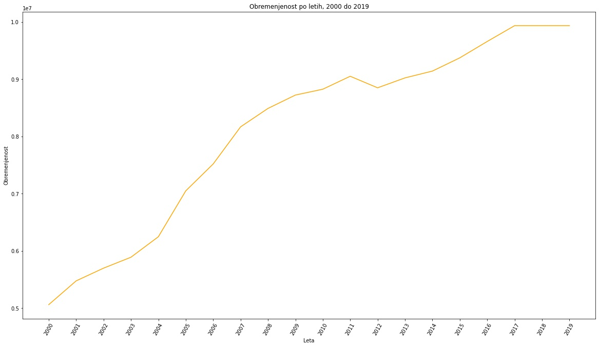
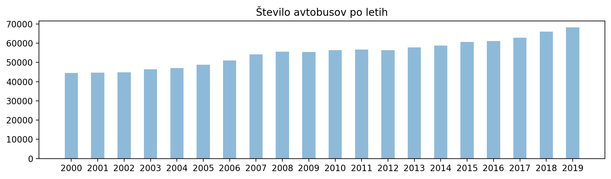
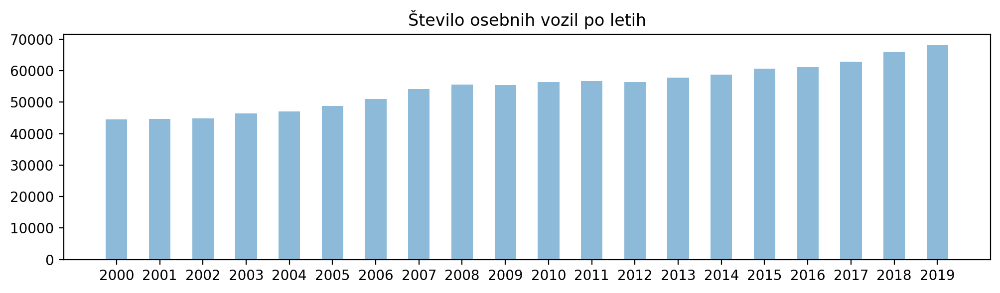
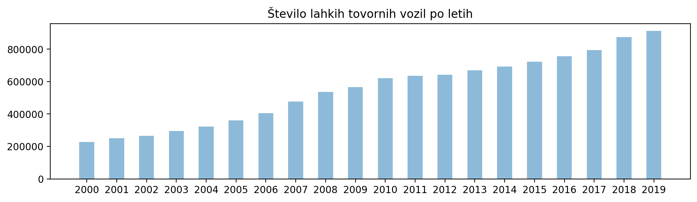
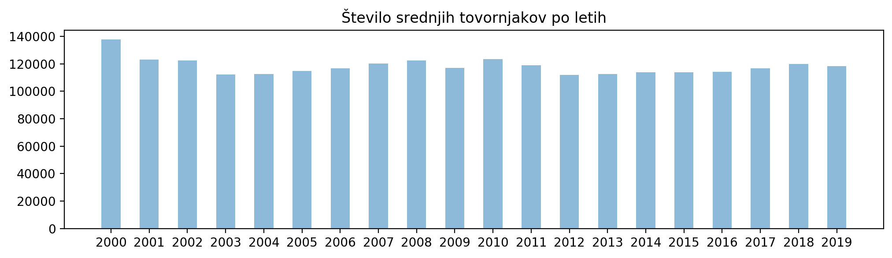
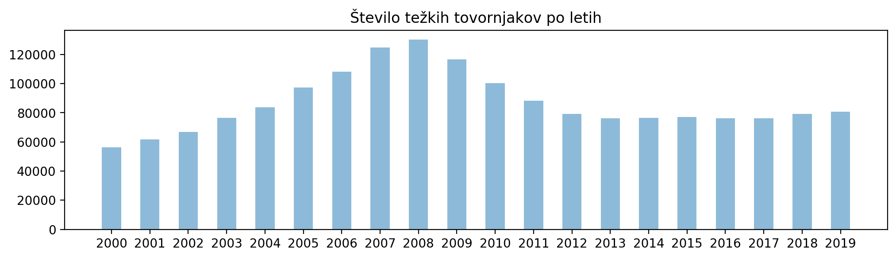
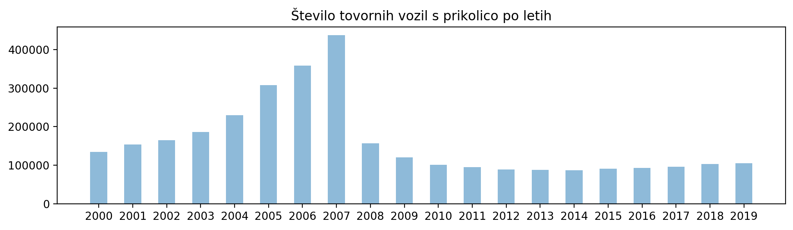
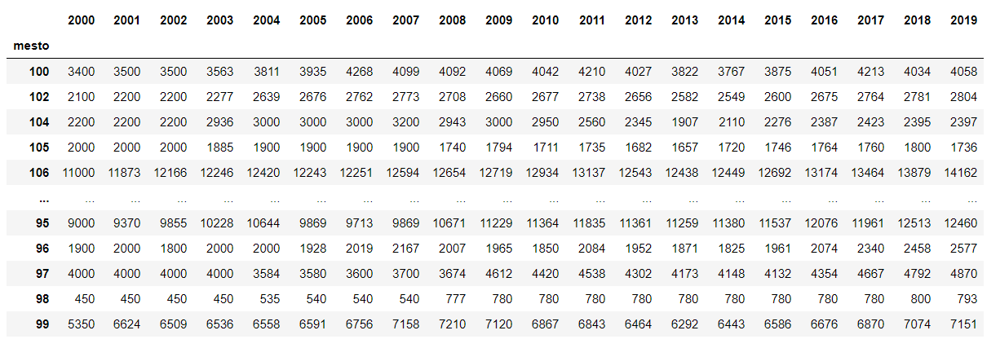
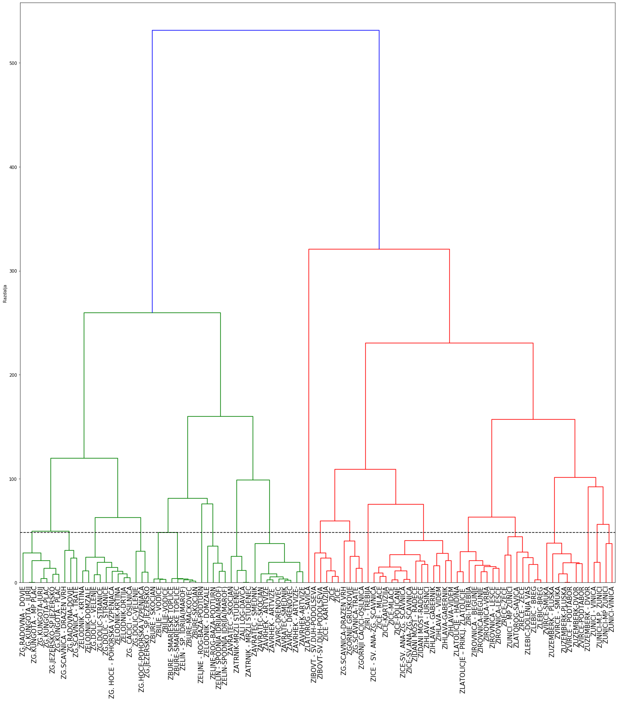

# PR21BKKTKVD
PR seminarska
## Avtorji:
    Benjamin Kovač Keber, 63190159 
    Tinkara Končan, 63190147
    Vito Drofenik, 63190094
    
    
## Opis podatkov
Podatki o prometnih obremenitvah so pripravljeni na osnovi podatkov iz avtomatskih 
števcev prometa na območju celotne Slovenije in podatkov, pridobljenih s posameznimi
ročnimi štetji prometa. Podatke smo pridobili iz spletne strani OPSI oziroma [Odprti 
Podatki Slovenije](https://podatki.gov.si/dataset/pldp-karte-prometnih-obremenitev). Namen zbiranja podatkov je bil spremljanje obremenjenosti posameznih cestnih odsekov skozi leta (od 2000 do 2019). Zapisani so v formatu csv.

## Tip in obseg podatkov
Podatki so števci. Število atributov se razlikuje glede na leto, med 18 in 21. Število primerov oz. merilnih mest je 969. Od teh se jih 456 pojavi v vseh letih.  

## Priprava podatkov
Najprej smo vse šumnike (č, š, ž) v .csv datotekah zamenjali s "c, s, z". Odstranili smo legendo na koncu vsake datoteke, tako da so ostali samo potrebni podatki. Za vse to smo uporabili Visual Studio Code. 

Za nekatera vprašanja je bilo pomembno, da odstranimo mesta, ki se niso pojavila v celotnem časovnem obdobju, ki smo ga obdelovali.

Ko smo imeli podatke urejene, smo jih prebrali v pandas dataframe, vsako leto v svojo spremenljivko. Pri branju podatkov smo morali biti pozorni pri tem, da smo odstranili znake za ločevanje tisočic, sicer so bili podatki upoštevani kot decimalna števila. Nekateri podatki so bili po nepotrebnem zapisani z decimalno vejico, tako da smo še te spremenili v cela števila.

Če je bilo potrebno, smo podatke združili v en sam podatkovni okvir.

Pred gručenjem smo morali odstraniti vse stolpce podatkovnih okrivjev, ki niso bili skupni vsem podatkovnim okvirjem. Nekatere vrstice so vsebovale same ničle, tako da smo jih morali ostraniti. 

## Glavna vprašanja
### Ali se je od leta 2000 do leta 2019 obremenjenost državnega cestnega omrežja Slovenije kaj spremenila?

Iz grafa je vidno, da je obremenjenost od leta 2000 do 2010 skoraj neprestano naraščala. Med letoma 2011 in 2012 je padala, nato pa je začela spet naraščati. Od leta 2012 obremenjenost počasneje narašča. Domnevamo, da zato, ker so se ljudje začeli bolj osveščati o okolju in poskušajo najti druge, alternativne možnosti prevoza, ki zmanjšujejo obremenjenost. 

### Kako se je spremenila obremenjenost državnega cestnega omrežja Slovenije v času gospodarske krize leta 2008?
Gospodarska kriza očitno na obremenjenost ni vplivala, saj je vse do leta 2010 naraščala.

### Kako so se spreminjale količine posameznih tipov vozil skozi leta?
Količina posameznih tipov vozil se spreminja različno.

Število avtobusov po letih enakomerno narašča.

Število osebnih vozil po letih rahlo enakomerno narašča.

Število lahkih tovornih vozil bolj strmo narašča.

Število srednje težkih tovornih vozil se ne spreminja izrazito.

Število težkih tovornih vozil do leta 2008 narašča, nato je padlo in se ustalilo na približno enaki količini, kot pred letom 2004. 

Število tovornih vozil s prikolico do leta 2007 narašča, nato pa krepko pade. Domnevamo, da zaradi gospodarske krize, ki se je zgodila leta 2008 in je pustila posledice še v kasnejših letih. 

### Kako se je spreminjala obremenitev posameznih prometnih odsekov skozi leta?

**Spreminjanje enega ali dveh odsekov skozi leta - graf**

### Ali lahko odseke razdelimo v skupine samo glede na količino posameznih vrst vozil?

Metoda hierarhičnega gručenja, ki smo jo uporabili, je uspešno razdelila odseke v skupine. Odseke, ki so geografsko blizu, je razdelila v iste skupine samo z upoštevanjem količin različnih vrst vozil. 

