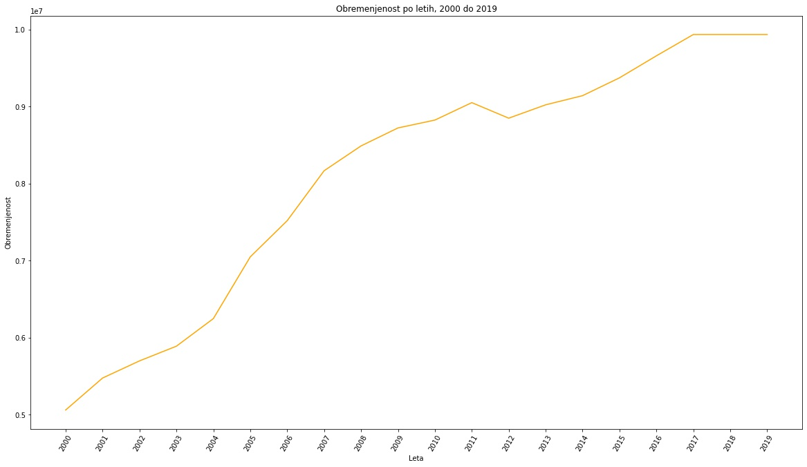
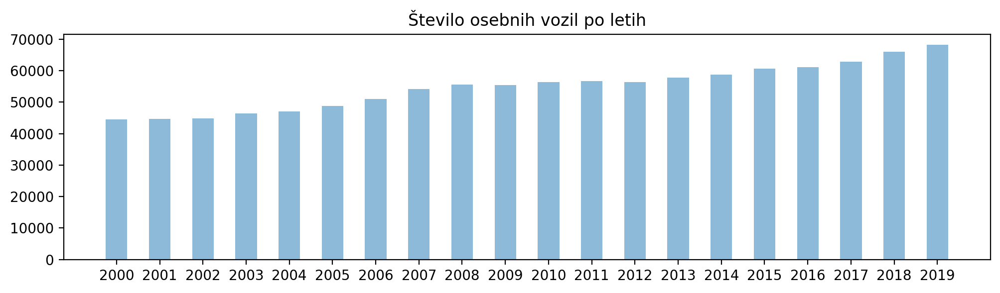
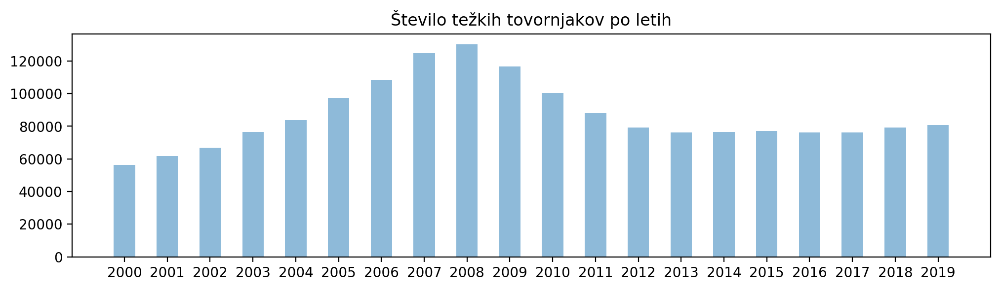
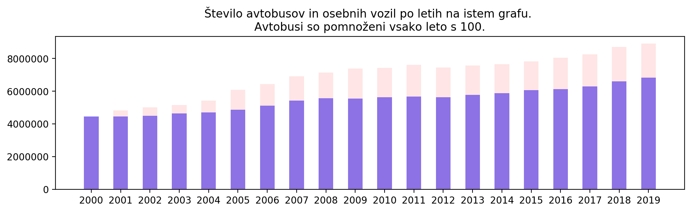
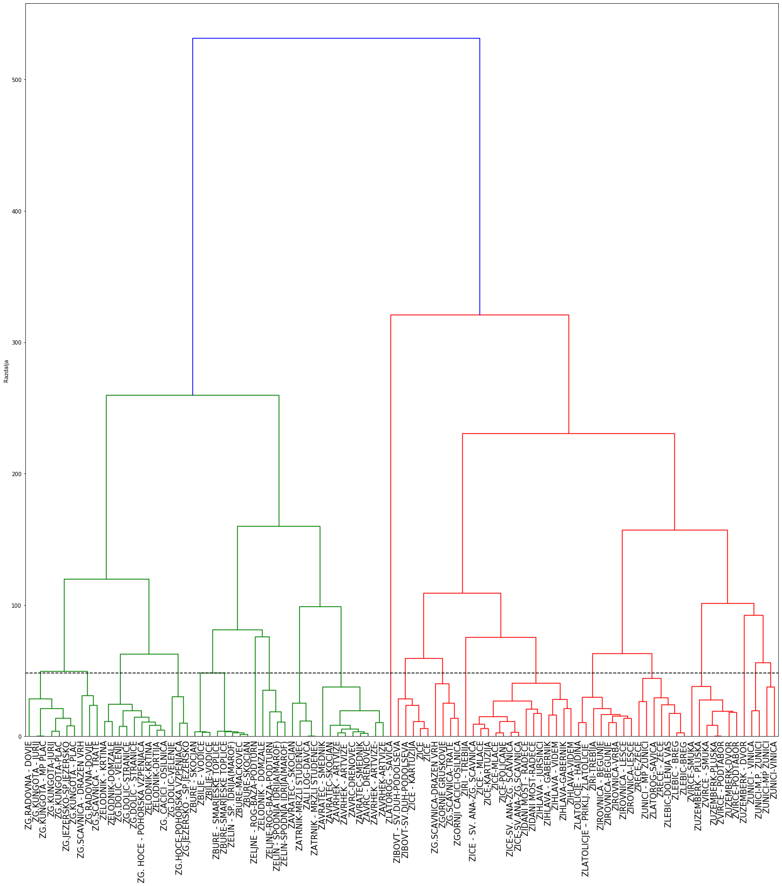
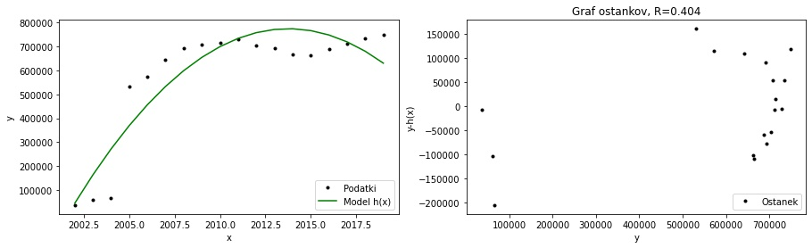

# PR21BKKTKVD
PR seminarska
## Avtorji:
    Benjamin Kovač Keber, 63190159 
    Tinkara Končan, 63190147
    Vito Drofenik, 63190094
    
    
## Opis podatkov
Podatki o prometnih obremenitvah so pripravljeni na osnovi podatkov iz avtomatskih 
števcev prometa na območju celotne Slovenije in podatkov, pridobljenih s posameznimi
ročnimi štetji prometa. Podatke smo pridobili iz spletne strani OPSI oziroma [Odprti 
Podatki Slovenije](https://podatki.gov.si/dataset/pldp-karte-prometnih-obremenitev). 
Namen zbiranja podatkov je bil spremljanje obremenjenosti posameznih cestnih odsekov skozi 
leta (od 2000 do 2019). Zapisani so v formatu csv. 

Uporabili smo tudi podatke o dolžinah javnih cest,
 ker so bili zraven podatki o regijah (v kateri regiji je kakšen odsek). Prav tako smo jih pridobili na strani
 [OPSI](https://podatki.gov.si/dataset/dolzine-javnih-cest-po-obcinah-od-leta-2002). Zapisani so bili v formatu xls. 

## Tip in obseg podatkov
Glavni podatki so števci. Število atributov se razlikuje glede na leto, med 18 in 21. Število primerov oz. merilnih mest je 969. 
Od teh se jih 456 pojavi v vseh letih.  
Za napovedovanje smo dodali še eno podatkovno množico, iz katere smo uporabili podatke o odsekih in njihovih regijah.

## Priprava podatkov
Najprej smo vse šumnike (č, š, ž) v .csv datotekah zamenjali s "c, s, z". Odstranili smo legendo na koncu vsake datoteke, 
tako da so ostali samo potrebni podatki. Za vse to smo uporabili Visual Studio Code. 

Za nekatera vprašanja je bilo pomembno, da odstranimo mesta, ki se niso pojavila v celotnem časovnem obdobju, ki smo ga obdelovali.

Ko smo imeli podatke urejene, smo jih prebrali v pandas dataframe, vsako leto v svojo spremenljivko. Pri branju podatkov smo 
morali biti pozorni pri tem, da smo odstranili znake za ločevanje tisočic, sicer so bili podatki upoštevani kot decimalna števila. 
Nekateri podatki so bili po nepotrebnem zapisani z decimalno vejico, tako da smo še te spremenili v cela števila.

Če je bilo potrebno, smo podatke združili v en sam podatkovni okvir.

Pred gručenjem smo morali odstraniti vse stolpce podatkovnih okrivjev, ki niso bili skupni vsem podatkovnim okvirjem. 
Nekatere vrstice so vsebovale same ničle, tako da smo jih morali ostraniti. 

Pri drugi podatkovni množici smo s pomočjo excela najprej zamenjali vrstni red listov, da so bili tisti, iz katerih 
smo pobirali podatke na prvem mestu (za lažje branje datotek). Prav tako smo odstranili legendo, ki je bila na koncu vsakega
lista.

## Glavna vprašanja
### Ali se je od leta 2000 do leta 2019 obremenjenost državnega cestnega omrežja Slovenije kaj spremenila?

Iz grafa je vidno, da je obremenjenost od leta 2000 do 2010 skoraj neprestano naraščala. Med letoma 2011 in 2012 je 
padala, nato pa je začela spet naraščati. Od leta 2012 obremenjenost počasneje narašča. Domnevamo, da zato, ker so 
se ljudje začeli bolj osveščati o okolju in poskušajo najti druge, alternativne možnosti prevoza, ki zmanjšujejo obremenjenost. 

### Kako se je spremenila obremenjenost državnega cestnega omrežja Slovenije v času gospodarske krize leta 2008?
Gospodarska kriza očitno na obremenjenost ni vplivala, saj je vse do leta 2010 naraščala.

### Kako so se spreminjale količine posameznih tipov vozil skozi leta?
Količina posameznih tipov vozil se spreminja različno.

Število avtobusov po letih enakomerno narašča.

Število osebnih vozil po letih rahlo enakomerno narašča.

Število lahkih tovornih vozil bolj strmo narašča.

Število srednje težkih tovornih vozil se ne spreminja izrazito.

Število težkih tovornih vozil do leta 2008 narašča, nato je padlo in se ustalilo na približno enaki količini, kot 
pred letom 2004. 

Število tovornih vozil s prikolico do leta 2007 narašča, nato pa krepko pade. Domnevamo, da zaradi gospodarske krize, 
ki se je zgodila leta 2008 in je pustila posledice še v kasnejših letih. 

Zanimalo nas je, kako so različne vrste vozil naraščale relativno ena glede na drugo. Na en graf smo izrisali dve vrsti vozil, 
vsako v svoji barvi, za lažjo predstavo.

Opazimo, da število avtobusov in osebnih vozil narašča z relativno enako hitrostjo 
(je pa osebnih vozil pribljižno 100-krat več kot avtobusov).

Za primerjavo smo izrisali še črtni grafikon, iz katerega je bolj razviden trend.

Grafa tovornih vozil s prikolico in težkih tovornjakov po letih na skupni sliki. 
Lepo se vidi, da je število obojih do gospodarske krize leta 2008 naraščalo (tovornih vozil s prikolico 
je do tega leta do 3-krat več na leto kot težkih tovornjakov). Od 2008 naprej je število tovornih 
vozil s prikolico strmo padlo, število težkih tovornjakov pa malo manj strmo, a še vseeno. 
Okoli leta 2013 je število obeh vrst vozil začelo ponovno naraščati.

### Kako se je spreminjala obremenitev posameznih prometnih odsekov skozi leta?

Obremenitev je do leta 2007 naraščala. V času krize leta 2008 je začela obremenitev padati. Sklepamo, da so bili nekateri zaradi 
manjših prihodkov prisiljeni prodati avto in začeti uporabljati javni promet. Ko se je gospodarstvo po krizi začelo izboljševati, 
se je začela spet povečevati tudi obremenitev. 

V letu 2005 se je začel projekt, ki se je trudil osveščati ljudi o pomembnosti zmanjšanja prometa. Tudi to bi lahko bila možnost, 
zakaj je obremenitev v prihodnih letih padla. 

### Ali lahko odseke razdelimo v skupine samo glede na količino posameznih vrst vozil?

Metoda hierarhičnega gručenja, ki smo jo uporabili, je uspešno razdelila odseke v skupine. Odseke, ki so geografsko 
blizu, je razdelila v iste skupine samo z upoštevanjem količin različnih vrst vozil. 

### Napovedovanje 
#### Napovedovanje tipov vozil
Zanimalo nas je, če bi se dalo napovedati količino posameznega tipa vozil s pomočjo ostalih vrst vozil. Za napovedovanje smo uporabili
linearno regresijo. Hitro smo ugotovili, da je to nesmiselno. Prav tako so bile napake čisto prevelike (rmse je bil 533).

#### Napovedovanje količine prometa s pomočjo regij
Za ta del smo uporabili podatke o dolžinah javnih cest, saj so imeli podatke o regiji, v kateri se nahaja odsek. 
Originalnim podatkom smo dodali regijo, in izločili vse odseke, ki se ne pojavljajo v vseh letih. Uporabili smo podatke od leta
2002 dalje, saj druga podatkovna zbirka ni vsebovala podatkov o prejšnjih letih. 

Želeli smo napovedati skupno količino vozil v enem letu znotraj ene regije. Naši testni podatki, na katerih smo izvedli napovedovanje, 
so bili podatki o odsekih znotraj Savinjske regije. Ker smo želeli napovedovati le stolpec, ki vsebuje vsoto vseh vozil, smo
sešteli celoten stolpec "Vsa vozila (PLDP)" za vsako leto. Nato smo izvedli linearno regresijo. 

Izrisali smo razsevni diagram, na katerega smo izrisali regresijsko premico, ki se podatkom najbolj prilagaja.
Premica podatkom sploh ni prilagajala, zato smo poskusili napovedovati še s polinomsko regresijo.

Model se je malo bolje ujemal, prav tako se je izboljšal rezultat. Še vedno pa ni bilo optimalno, model je delal zelo velike napake.

Ko smo razmišljali, zakaj je temu tako, smo prišli do ugotovitve, da je najbrž podatkov premalo (imamo le toliko podatkov, kot je let).
Prav tako se nam zdi, da so zgodnji podatki (2002-2004) zavajajoči. Na Savinjskem je bila leta 2005 dokončana avtocesta, zato
je bilo v prihodnjih letih bistveno več odsekov in posledično več prometa.

# Povzetek
Med izdelavo projektne naloge smo ugotovili, da niso vsi podatki enakovredni. Nekateri podatki niso najbolj primerni za obdelavo.
Žal smo lahko le izrisali nekaj grafov ter izvedli gručenje. Nismo mogli dobro napovedovati, čeprav se je sprva zdelo, da bomo lahko. Morda bi bili 
boljši rezultati, če bi imeli zraven dodatne informacije, kot so npr. vreme, ali pa da bi bili podatki razdeljeni po mesecih namesto
po letih. Največ dela smo imeli z obdelavo podatkov in ugotavljanjem, kaj bi lahko s temi podatki sploh naredili.
